**自启动项的研究与软件实现**

# 目录

* [设计要求](#设计要求)
* [原理、实践与实现思路](#原理实践与实现思路)
* [详细设计与开发](#详细设计与开发)
  * [概述](#概述)
  * [开发环境](#开发环境)
  * [图形界面](#图形界面)
  * [主要功能函数](#主要功能函数)
    * [注册表读取](#注册表读取)
    * [字符串处理](#字符串处理)
    * [计划任务文件读取](#计划任务文件读取)
    * [提取签名信息](#提取签名信息)
  * [Logon实现](#logon实现)
    * [自启动目录实现](#自启动目录实现)
    * [注册表实现](#注册表实现)
    * [代码流程](#代码流程)
    * [结果演示](#结果演示)
  * [Services实现](#services实现)
    * [代码流程](#代码流程-1)
    * [结果演示](#结果演示-1)
  * [Drivers实现](#drivers实现)
    * [代码流程](#代码流程-2)
    * [结果演示](#结果演示-2)
  * [Scheduled tasks实现](#scheduled-tasks实现)
    * [代码流程](#代码流程-3)
    * [结果演示](#结果演示-3)
  * [Known Dlls实现](#known-dlls实现)
    * [代码流程](#代码流程-4)
    * [结果演示](#结果演示-4)


# 设计要求

1. 结合课堂所讲授的内容，围绕着“Windows 自启动项的查看和分析”主 题，查阅课外资料，编写验证代码，动手进行实验，撰写一份技术研究和设计开发报告。
2. 可以参考 `SysinternalsSuite` 工具集中的 `Autoruns` 软件，了解在 Windows 系统中有哪些可以实现自启动的技术方法，然后分析它们各自的技术原理、实现 细节和隐蔽性状况，撰写到课程报告之中。
3. 编写自己的 Windows 自启动项查看软件。

# 原理、实践与实现思路

&emsp;&emsp;自启动是许多木马会使用的技术，如挖矿木马、远控木马等，因此，检测自启动项是除了测试网络连接外的检测木马的重要技术。常见有以下三类自启动技术，其中，本报告主要分析的是前两类：

1. 随着计算机启动而启动
2. 随用户登录而启动
3. 随软件运行而启动

&emsp;&emsp;下面列举了属于前两大类的几种自启动技术，其中，打钩的是我在设计实现中完成的几种，并将在后面进行原理的研究分析：

- [x] Logon：启动目录，基于注册表启动
- [x] Services：系统服务
- [x] Drivers：系统驱动程序
- [x] Scheduled Tasks：计划任务
- [ ] Internet Explorer：IE 浏览器的 BHO 对象 
- [ ] Boot Execute：启动执行
- [ ] Image Hijacks：映像劫持
- [x] Known DLLs：知名动态链接库
- [ ] Winsock Providers：Winsock 服务提供程序
- [ ] Winlogon：用户登录通知程序

&emsp;&emsp;考虑到有些实践需要重启电脑，方便起见，虽然我的代码实现在win10上，但是报告内的实践部分截图来自win7虚拟机。


--删除--


# 详细设计与开发

## 概述

   结合各种自启动方法的**原理分析**，我在每一部分下已经写出了根据原理得到的**实现的基本思路**，因此这部分将主要说明**代码的具体实现**。

   此外，我还参考 `SysinternalSuit` 工具集中的自启动项查看软件 `Autoruns.exe`，并查阅[msdn](https://docs.microsoft.com/zh-cn/)上的相关API的使用资料，使用C++编写了自己的Windows自启动项查看的命令行程序，由于时间关系，尚未实现QT界面的编写。

   目前，我实现了以下自启动项种类的查看：

- [x] Logon：启动目录，基于注册表启动
- [x] Services：系统服务
- [x] Drivers：系统驱动程序
- [x] Scheduled Tasks：计划任务
- [x] Known Dlls：知名动态链接库

## 开发环境

|  环境/语言   |             版本              |
| :----------: | :---------------------------: |
|   测试系统   |   Win7 专业版/Win10 家庭版    |
| 编程(译)平台 | Qt creator 4.11.1(32位社区版) |
|   编程语言   |              C++              |
|   GUI实现    |     QT 5.14.2 (msvc环境)      |

## 图形界面

   首先用 `QT Designer` 设计大致的图形界面：

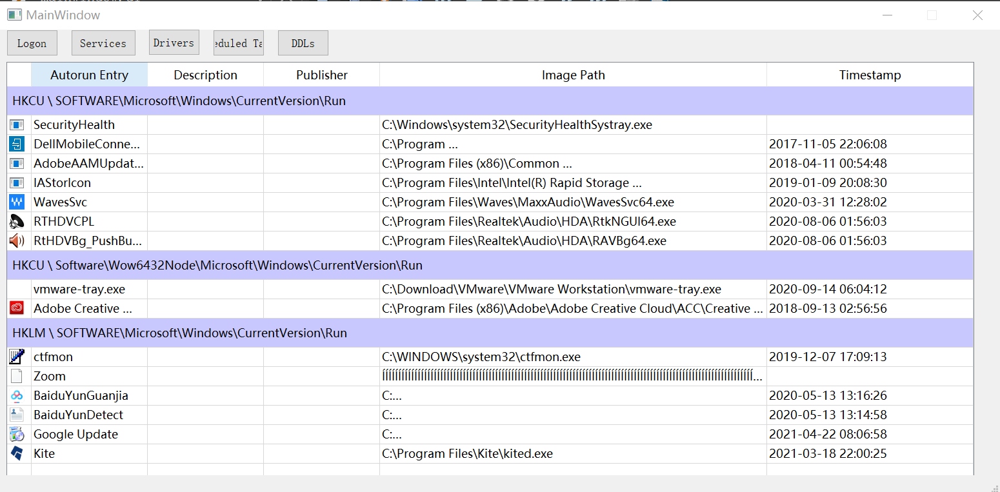 

   程序启动时先初始化表格的每列宽度，然后默认先显示 `logon` 自启动项：

```c++
// 入口函数
MainWindow::MainWindow(QWidget *parent)
    : QMainWindow(parent)
    , ui(new Ui::MainWindow)
{
    ui->setupUi(this);
    //初始化表列宽:entry descryption publisher imagepath timestamp
    ui->autoruns_table->setColumnWidth(0, 10);
    ui->autoruns_table->setColumnWidth(1, 180);
    ui->autoruns_table->setColumnWidth(2, 180);
    ui->autoruns_table->setColumnWidth(3, 180);
    ui->autoruns_table->setColumnWidth(4, 600);
    ui->autoruns_table->setColumnWidth(5, 180);

    //logon自启动项
    set_logon_table();
}
```

   接下来开始分析为每个按钮编写对应的自启动项查找与显示函数。

## 主要功能函数

   很多项对注册表或文件夹的读取都有可以共用的函数。我主要在各个头文件里实现了以下几个主要的功能函数。`3.5` 及之后的部分都使用这些功能函数进行简要的实现流程说明。

### 注册表读取

   头文件 `read_register.h`。

   参考 [`msdn`](https://docs.microsoft.com/zh-cn/windows/win32/api/winreg/nf-winreg-regopenkeyexa) 对注册表相关的 `Windows API` 的范例和接口描述，实现了以下几个函数：

**1. 读取指定注册表子键“计算机\root_key\sub_key ”下所有值和数据的函数，返回<值的名字，值的数据>的 `map`：`read_value_data(HKEY root_key, LPCUTSTR sub_key)` **

   里面使用到以下几个 `Windows API`：`RegOpenKeyEx` 获取某主键下某子键的注册表句柄，`RegQueryInfoKey` 获取句柄对应的子键里键值的数量、等信息；`RegEnumValue` 获取键值的名字 `entry` 与数据。

   流程如下图：


   在这个函数里需要考虑**注册表的重定向问题**，在不同位数的系统上，不同位数的程序使用不同的权限位访问 `HKLM\Software` 时，实际访问的注册表位置如下表所示。因此在 `API` `RegOpenKeyEx` 的权限位参数使用 `KEY_READ|KEY_WOW64_64KEY` 就可以解决这个问题。

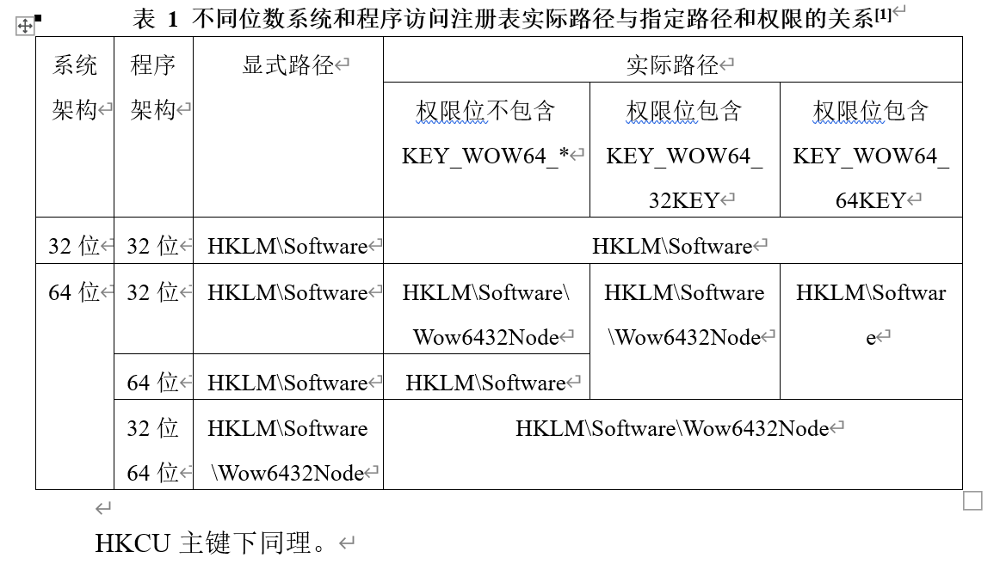

**2. 读取指定子键 `计算机\root_key\sub_key`下所有子键的名称的函数： `read_subkey_name(HKEY root_key, LPCTSTR sub_key)`**

   使用API和函数 `read_value_data` 差不多，流程如下图：


### 字符串处理

   头文件 `str_convert.h` 和 `format_something.h`。

**1. 对注册表内的路径型数据字符串处理的函数：**

- **`format_imagepath(QString* value)` ：标准化从注册表读取的键值的可执行文件路径数据**

   当值的数据是可执行文件相关的执行命令/路径时候，有很多会是如下情况的：
1）形如 `"C:\Program Files\Kite\kited.exe" --system-boot` 含有双引号，包括 `- command、/command、@、??` 等
2）显示的是环境变量而不是实际路径：%windir%、%systemroot%、%localappdata%、%programfiles%
3）不显示完整的绝对路径：\systemroot、system32、syswow64

   但是读取具体的可执行文件验证签名、或显示到界面的 `imagepath` 上时，都需要真正的路径。这个函数可以综合上述几种情况，把转换成 `QString` 后的注册表的数据标准化成真正exe存在的路径。

- **`format_description(QString path,QString *content)` ：读取服务/驱动注册表子键下的值 `description` 的dll指向的文本描述信息**   

   从服务/驱动注册表子键下的值 `description` 能读取到的一般都是如下内容：

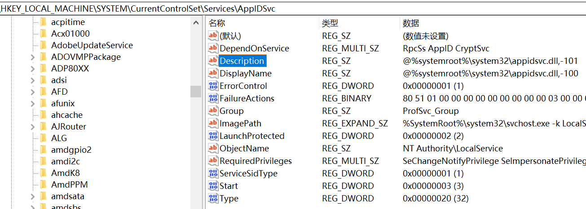

   真正的描述信息位于数据存储的，@开头的dll路径指向的的文本资源里。使用这个函数可以先标准化dll路径（不去除后面的-101等标志位，因此和上一个函数有所不同），然后用 `SHLoadIndirectString` 函数实现从给定的以 "@" 符号开头的间接字符串指向的文本资源里读取描述信息。

- **`format_description_path(QString* value)`：**

   上述@开头的dll路径中大量不是真实的绝对路径，而是一样包含环境变量，所以用这个函数替换环境变量成真实路径，否则 `SHLoadIndirectString` 函数无法成功获取文本资源。其中固定环境变量直接手动替换字符串，随机器改变的字符串用 `getenv("环境变量名")` 动态获取。

**2. 字符串类型转换**

   `Qt` 的 `QTableWidget` 部件写入函数参数都要求 `QString` ，但 `Windows API` 使用的参数基本都是 LPBYTE、PWSTR、TCHAR、PTSTR等；用于存储注册表读取信息的map使用了char *类型；`Windows API` 对不同字符编码集（多字节编码、宽字节Unicode编码）多有两种函数且内部参数类型有所区别。因此需要对以上字符串类型进行转换，最终目标为转换成使用的函数所需参数类型、或转换成 `QString` 以便于能在 `Qt` 界面上正常显示。

   头文件 `str_convert.h` 里编写了代码里需要使用的全部字符串类型转换函数。这部分基本从网上各处搜来，经过断点测试成功后就放入头文件使用。

### 计划任务文件读取

   头文件 `read_schedule_tasks.h`。

   `msdn` 上有比较完整的"[枚举任务名称和状态](https://docs.microsoft.com/zh-cn/windows/win32/taskschd/displaying-task-names-and-state--c---)"的API使用示范代码，读懂后直接修改并使用。不同的是需要递归获取文件夹 `C:\Windows\System32\Tasks` 下的所有文件与计划任务的可执行文件路径。

   实现的代码流程如下：


 

### 提取签名信息

   头文件 `get_PE_publisher.h`。

**1.  直接使用 `msdn` 提供的PE文件签名验证函数 `VerifyEmbeddedSignature`，[点击查看msdn](https://docs.microsoft.com/zh-cn/windows/win32/seccrypto/example-c-program--verifying-the-signature-of-a-pe-file)。用于验证标准化后的 `imagepath` 下的<u>可执行文件</u>的签名。**

  在后面提取 `imagepath` 时对所有 `.exe` 结尾的文件都用这个函数进行了签名的验证：

```c++
//签名验证结果
QString verify_result;
if (imagepath.endsWith("exe") )
{
    bool is_or_not_verified = VerifyEmbeddedSignature(imagepath.toStdWString().c_str());
    if(is_or_not_verified) verify_result = "Verified";
    else verify_result = "Not Verified";
}
else verify_result = "";
```

**2. 本想使用 `msdn` 提供的从 Authenticode 签名可执行文件中获取信息的示例代码，[点击查看](https://docs.microsoft.com/zh-cn/troubleshoot/windows/win32/get-information-authenticode-signed-executables)。用于从得到的 `imagepath` 可执行文件的签名中提取所需信息，即发布者 `publisher`。**

  代码位于 `get_PE_publisher.h` 但是可能由于宽字节与多字节的字符串类型转换原因，或者其他不明原因，均查找失败。因此我在结果中把这部分去掉了，只剩下上面的验证通过与否的信息。也还没有实现对其他类型文件（仅exe文件）签名的验证。

  【更新2021年6月13日18:30:30】经过修改，得到了可以使用的函数 `get_publisher`，可以获得文件的签名验证结果和签名者。但是不完全能验证正确（对比autoruns），因此后续优先使用这个函数验证签名，如果验证失败，而被验证的文件是exe文件，就再次调用 `VerifyEmbeddedSignature` 更新验证结果。

**3. 获取时间戳**

  2.中也有能用于获取时间戳的函数，但调试很久也无法输出正常信息。此外，在另外查到的验证签名的函数 `verify()` 里（头文件 `check_PE_signature.h` ）也有输出文件相关时间信息的功能，但是也没有调通。最后查看这些函数里的时间信息，发现不有从可执行文件的前面信息里提取的，还有文件本身的修改/创建时间。所以使用Qt的库获取可执行文件的相关时间：

```c++
QFileInfo file_info(imagepath);
QDateTime file_create_datetime = file_info.created();
QString file_create_time = QObject::tr("%1").arg(file_create_datetime.toString("yyyy-MM-dd hh:mm:ss"));
QTableWidgetItem* timestamp_item = new QTableWidgetItem(file_create_time);
ui->autoruns_table->setItem(row_index, 5, timestamp_item);
```

## Logon实现

点击 `Logon` 按钮，程序查找并罗列相关的自启动项，主要有：

1. 自启动目录
2. 注册表自启动项

### 自启动目录实现

   原本打算使用vc的MFC里的CFindFile类实现，但是发现 `afx.h` 和 `Windows.h` 存在冲突，于是放弃。换成使用Qt的`<QFileDialog>` 相关的函数实现两个文件夹的读取：获取到文件夹内文件列表 `list` 后，for循环取每个文件，使用 `.fileName()` 和 `.filepath()` 获取文件名与路径，路径结尾exe的程序同样使用函数 `VerifyEmbeddedSignature` 验证签名。

```c++
/*
        查找自启动目录
    */
char* env1,*env2;
env1 = getenv("USERPROFILE");
env2 = getenv("ProgramData");

QString path1 = charstr_to_QString(env1) + "\\AppData\\Roaming\\Microsoft\\Windows\\Start Menu\\Programs\\Startup";
QString path2= charstr_to_QString(env2) + "\\Microsoft\\Windows\\Start Menu\\Programs\\StartUp";

QString paths[] = {path1,path2};

// 获取所有文件名
for(int i=0;i<2;i++)
{
    QDir *dir=new QDir(paths[i]);
    if (!dir->exists())
        qDebug()<<"no files";
    dir->setFilter(QDir::Dirs | QDir::Files | QDir::NoDotAndDotDot);
    QFileInfoList list = dir->entryInfoList();

    if(list.size() == 0)
    {
        qDebug()<<"no files";
        break;
    }

    //画表：注册表子键头部
    write_header_to_table(row_index,"",paths[i]);
    row_index++;
    ui->autoruns_table->setRowCount(row_index + 1);

    for(int i = 0; i < list.size(); i++) 
    {
        QString entry,imagepath;
        entry = list.at(i).fileName();
        imagepath = list.at(i).filePath();

        QString verify_result;
        if (imagepath.endsWith("exe") )
        {
            bool is_or_not_verified = VerifyEmbeddedSignature(imagepath.toStdWString().c_str());
            if(is_or_not_verified) verify_result = "Verified";
            else verify_result = "Not Verified";
        }
        else verify_result = "";

        write_item_to_table(row_index,entry,"",verify_result,imagepath);
        row_index++;
        ui->autoruns_table->setRowCount(row_index + 1);
    }
}
```

### 注册表实现

   函数 `void MainWindow::set_logon_table()` 。

   列出主键 `HKLM` 和  `HKCU` 下的以下8个子键，其实不只8个子键，但由于数量较多，不一一列出：

```c++
HKEY HKLM_root_key = HKEY_LOCAL_MACHINE;//HKLM
HKEY HKCU_root_key = HKEY_CURRENT_USER;//HKCU
HKEY root_keys[] = {HKLM_root_key,HKCU_root_key};

LPCSTR sub_key1 = "SOFTWARE\\Microsoft\\Windows\\CurrentVersion\\Run";
LPCSTR sub_key2 = "SOFTWARE\\Microsoft\\Windows\\CurrentVersion\\RunOnce";
LPCSTR sub_key3 = "SOFTWARE\\Microsoft\\Active Setup\\Installed Components";
LPCSTR sub_key4 = "Software\\Wow6432Node\\Microsoft\\Windows\\CurrentVersion\\Run";
LPCSTR sub_key5 = "SOFTWARE\\Microsoft\\Active Setup\\Installed Components";
LPCSTR sub_key6 = "SOFTWARE\\Wow6432Node\\Microsoft\\Active Setup\\Installed Components";
LPCSTR sub_key7 = "SOFTWARE\\Microsoft\\Windows\\CurrentVersion\\RunOnceEx";
LPCSTR sub_key8 = "SYSTEM\\CurrentControlSet\\Control\\SafeBoot\\AlternateShell";
//所有子键
LPCSTR sub_keys[] = {sub_key1,sub_key2,sub_key3,sub_key4,sub_key5,sub_key6,sub_key7,sub_key8};
```

   组合后的每个子键下的每个键值是一个自启动项，用for循环遍历每个子键，对每个子键调用功能函数，读取并存储每个子键下的所有<值，数据>对，值是自启动项的名字，数据经过处理后是自启动项可执行文件的 `imagepath`，根据 `imagepath` 验证签名， 把每个<值，数据>对显示到界面的表格。

### 代码流程

   自启动目录的代码逻辑简单，在上面直接列出。

   自启动注册表的读取流程如下，具体的函数里实现了**注册表重定向的禁止操作**，详见主要功能函数的介绍。


### 结果演示

   刚打开程序默认显示Logon项，或点击Logon按钮显示以下内容。红框部分是自启动目录，其余是自启动注册表项。

   成功实现了签名的验证，但存在问题：只有 `exe` 可验证，放空的部分表示没有经过验证（而非验证不通过），因为我仅在 `msdn` 上找到了验证PE `.exe` 文件签名验证的函数 `VerifyEmbeddedSignature` ，还没有找到对 `.dll` 文件的验证 `API`，本应通用的 `WinVerifyTrust` 相关的应用也都进行了尝试（因失败全在代码中注释掉了），都以失败告终。

   Wow6432路径下的自启动项的重定向也得到了解决，见红框下的这部分。

   此外，`publisher` 栏由于不明原因无法由 `imagepath` 得到publisher信息，在传入的参数 `imagepath` 确定已经标准化的前提下，调用 `msdn` 提供的函数后依旧无法返回正确文本内容 ，考虑到上课时提过publisher信息是很容易伪造的，重要的是验证是否通过，因此只显示验证结果。

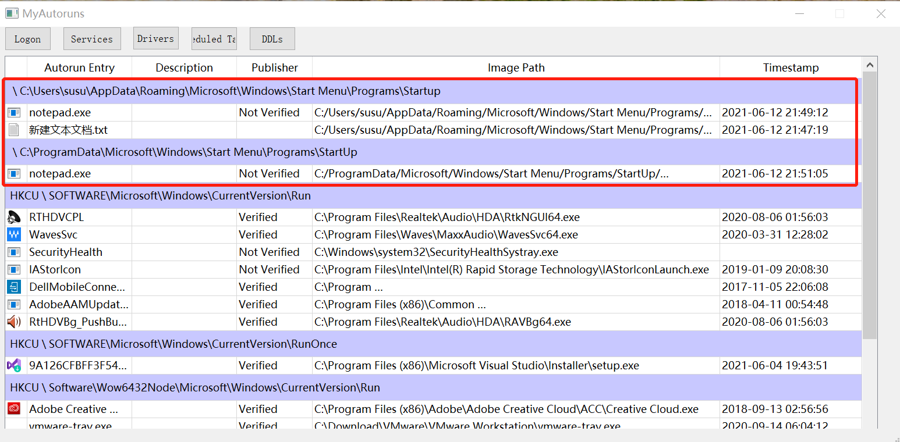

【更新2021年6月13日18:33:08】现在可以得到publisher了，验证功能做了优化。

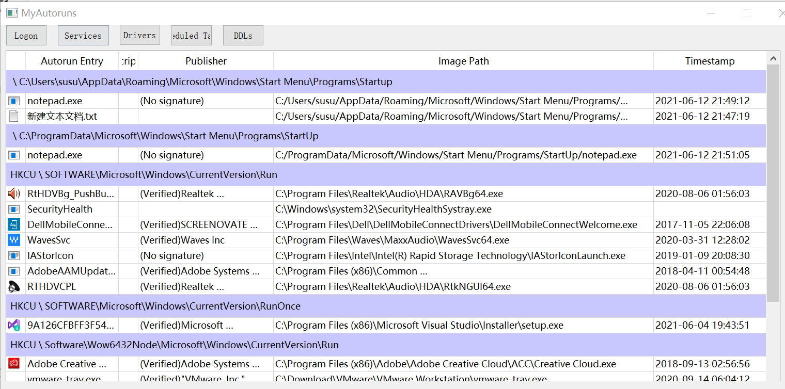


   对比下图 `autoruns` 软件的结果，基本可以对应上，基本功能得到实现：

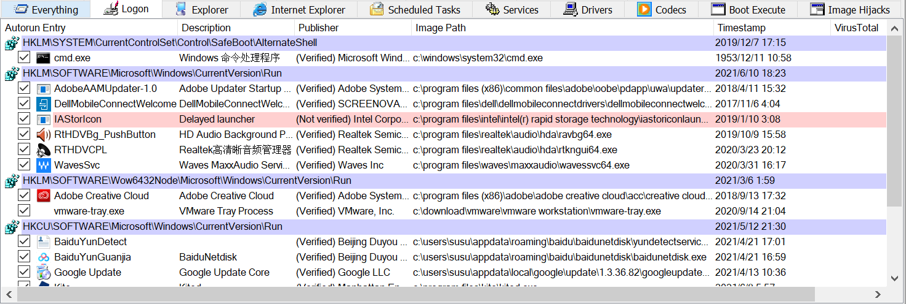

## Services实现

### 代码流程

   `Services` 和 `Drivers` 的实现仅在对共享服务进程可执行文件路径的处理上，其他几本相似，所以把流程图画到一起。


### 结果演示

   点击按钮后显示如下图，每列可以拖动，为了显示较长的路径信息，时间列没有显示完全。实现了共享进程的dll真实imagepath读取。

【更新2021年6月13日18:33:08】现在可以得到publisher了。

 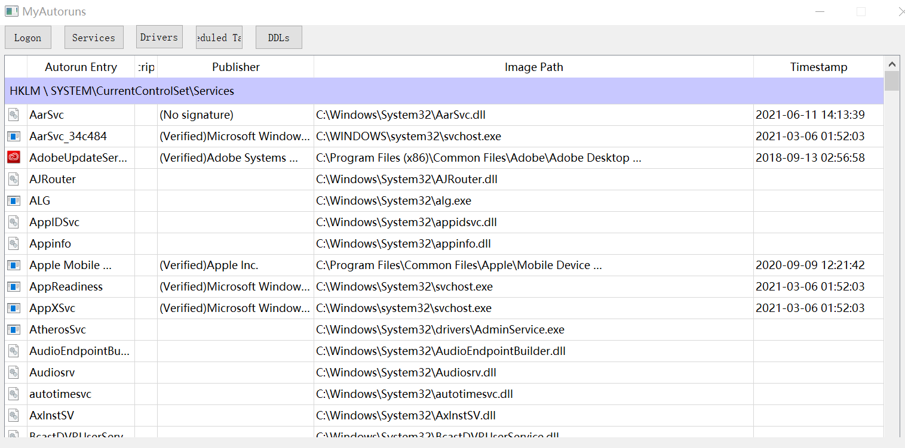

   对比下图 `autoruns` 软件，基本可以对应，基本功能得到实现：

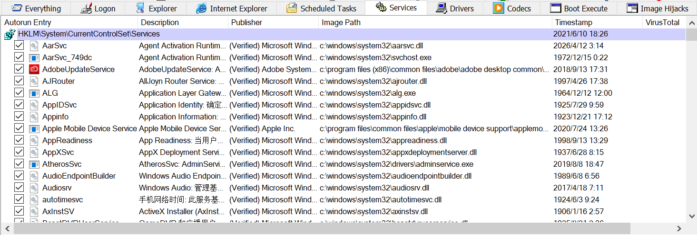

## Drivers实现

### 代码流程

   见 `3.6.1` Services的代码流程。

### 结果演示

【更新2021年6月13日18:33:08】现在可以验证签名了，但sys文件的验证依旧只有一小部分可以验证。

   点击 `Drivers` 按钮，显示如下。~~这里都是 `.sys` 文件，因此都没有实现签名验证，但是~~基本的 `imagepath` 和部分`description` 等内容读取成功。

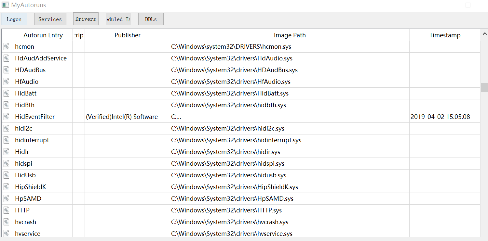

   对比 `autoruns` 软件，基本可以对应，基本功能得到实现：

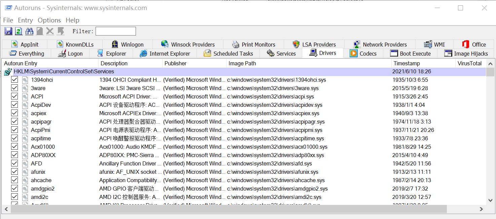

## Scheduled tasks实现

### 代码流程

   直接调用函数 `read_schedule_task_folder(&map_taskpath_imagepath)`，函数将读取Tasks根目录下的所有计划任务，并获取根目录下的文件夹，再调用 `read_schedule_task_subfolder()` 获取子文件夹下的任务，`read_schedule_task_subfolder()` 则递归调用自己，以获取所有层次文件夹下的计划任务。详细说明见 `3.4.3` 对这两个函数的解释。


### 结果演示

   点击按钮，结果如图所示，和 `autoruns` 对比后，存在的问题是错误地判断了很多应该通过验证的exe文件，目前不清楚原因，因为调用的是 `msdn` 提供的可以验证PE文件签名的函数，在 `Logon` 里的验证结果正确性也很高。

   `imagepath` 中有几个乱码，经过查看，应该是中文字符"新建文件夹"，因为Qt对字符编码的某些原因导致无法正常显示。

【更新2021年6月13日18:33:08】更新签名的验证。

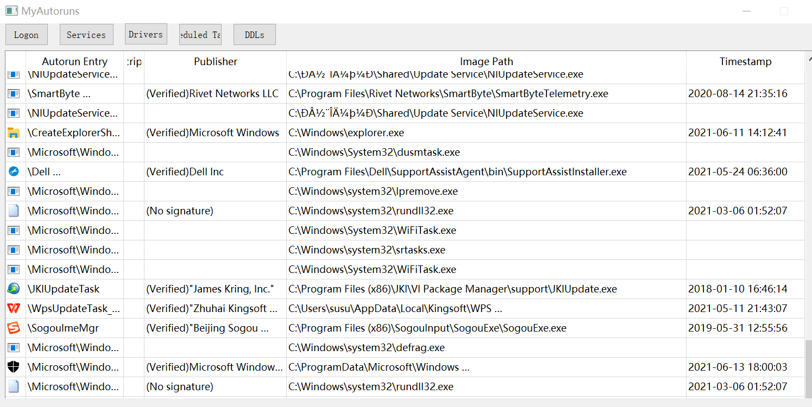

## Known Dlls实现

### 代码流程

   这部分几乎和 `Logon` 的实现一样，但只需读取一个子键下的键值，且由于 `Known Dlls` 的注册表键值里的数据都是dll文件而不是exe文件，我暂时无法实现对签名的验证。


### 结果演示

   点击按钮，结果如图所示，暂时无法从dll文件获取到签名验证信息：

【更新2021年6月13日18:33:08】更新签名的验证。

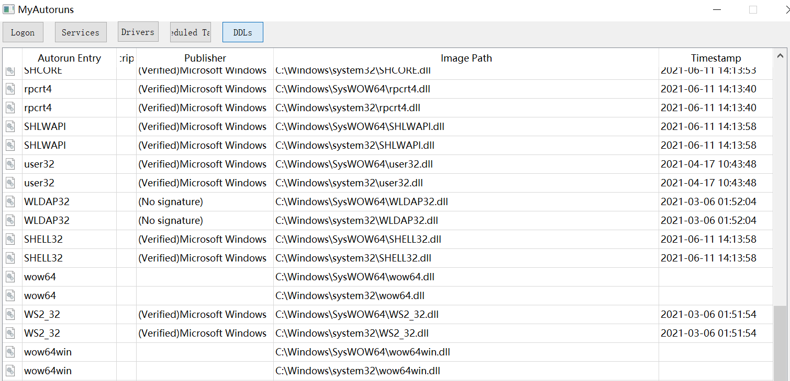

